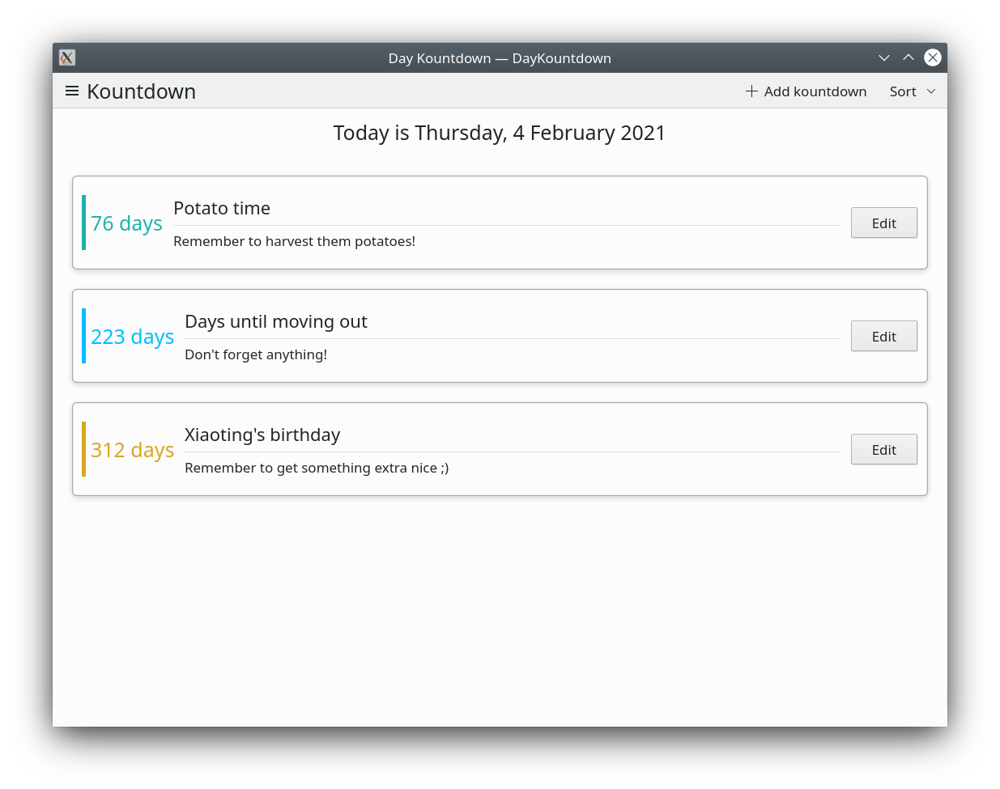
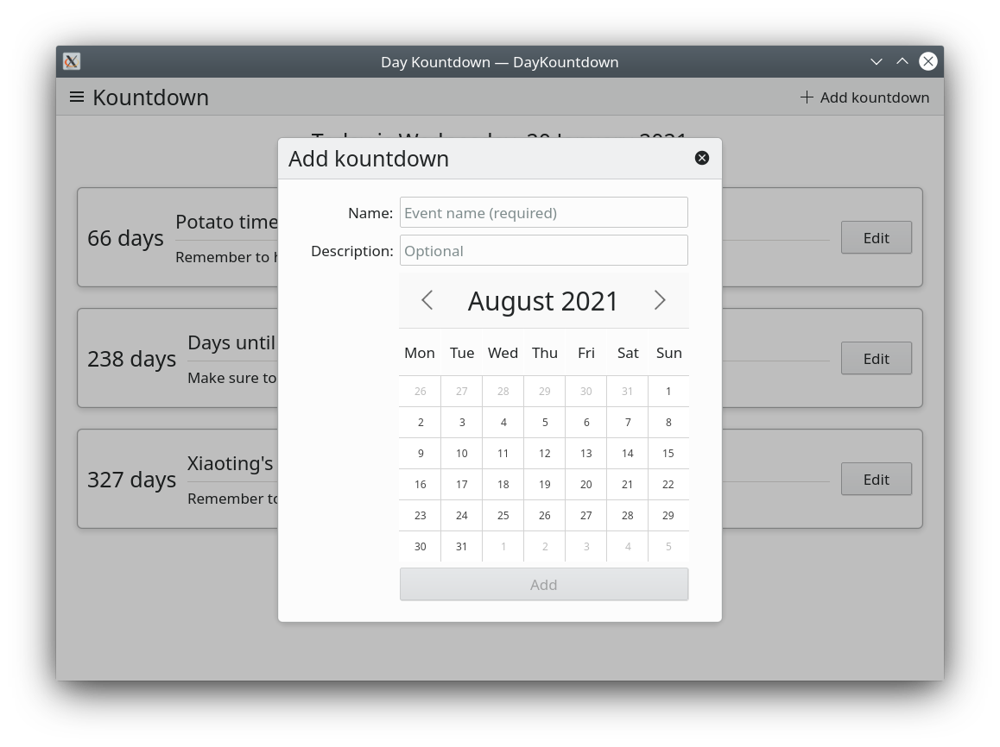

# DayKountdown
A simple countdown app written in QML/Kirigami and C++, for use with KDE Plasma on Linux.

The app counts the days towards a date of your choice.

It allows you to pick a date, provide a name, and a short description for your countdowns.

It is written in Kirigami, so it is also convergent!

## Features

- Adding and removing countdowns
- Compatibility with both desktop and mobile form factors
- Import and export countdowns from .JSON files
- Sorting by date, name, and creation time

## Prerequisites

- A Linux install
- Qt5 packages from your distribution's repositories
- KDE packages (including Kirigami)
- CMake
- Ninja

## Compiling

First, clone this repository through the terminal by running:

`git clone https://github.com/elChupaCambra/DayKountdown.git`

Then enter the cloned repo directory and create a new folder called `build`. 

Then, enter this folder:

`mkdir build && cd build`

Once that's done just run `cmake`, pointing it at the root repository directory:

`cmake ..`

Finally, all we need to do is run make:

`make`

Our binary will be located in `build/src/daykountdown`. Alternatively, we can install daykountdown by running:

`make install`

DayKountdown should now appear in your application menu!
