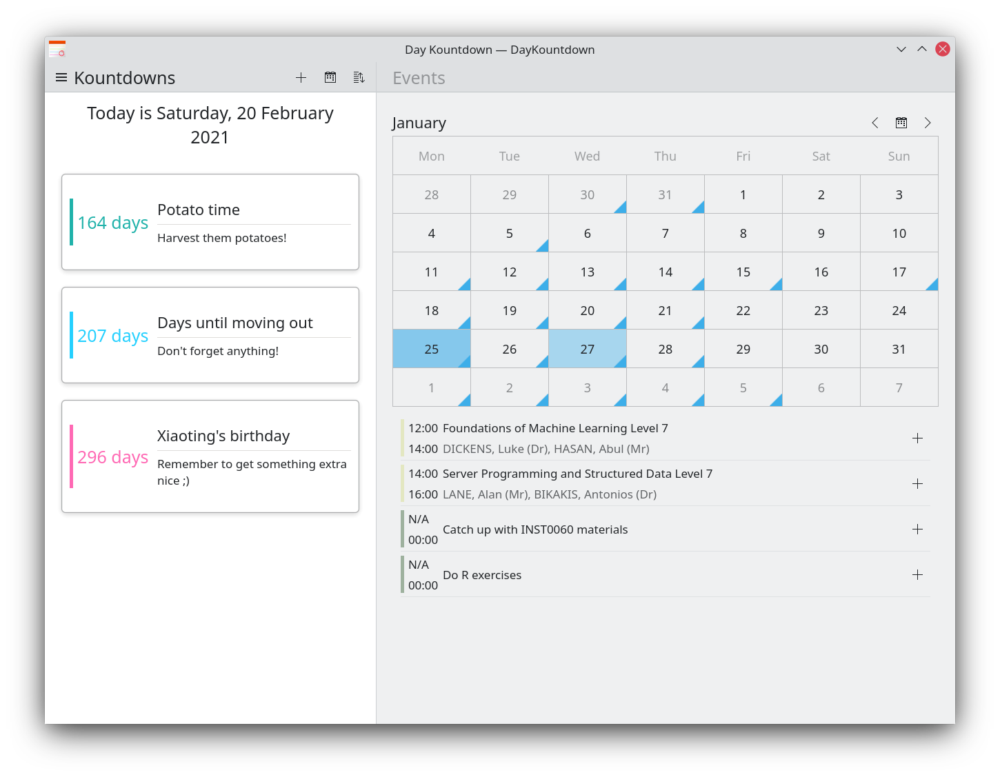
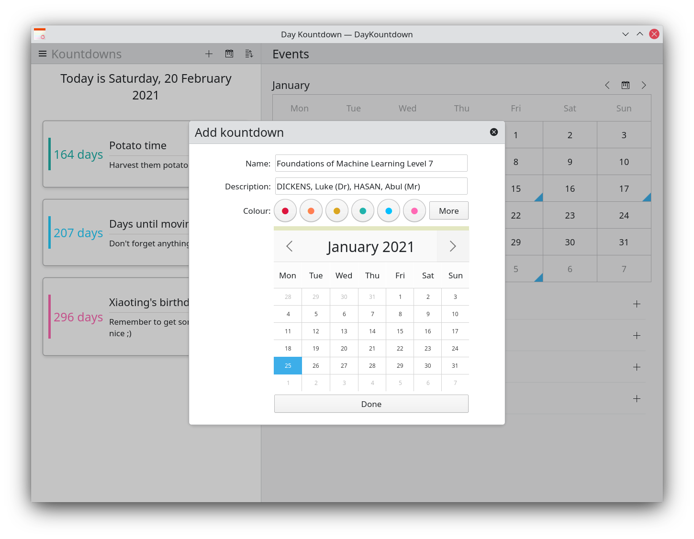

# DayKountdown
A date countdown app written in QML/Kirigami and C++, for use with KDE Plasma on Linux.

The app counts the days towards a date of your choice.

It allows you to pick a date, provide a name, and a short description for your countdowns.

There is also [an additional Plasma desktop widget](https://github.com/elChupaCambra/DayKountdown-Plasmoid) available for use with DayKountdown.

## Features

- Adding and removing countdowns
- Compatibility with both desktop and mobile form factors
- Import and export countdowns from .JSON files
- Sorting by date, name, and creation time
- Sync with your KDE Plasma calendars and easily add events from there into your countdowns

## Prerequisites

- A Linux install
- Qt5 packages from your distribution's repositories
- KDE packages (including Kirigami)
- CMake
- extra-cmake-modules

## Compiling

First, clone this repository through the terminal by running:

`git clone https://invent.kde.org/plasma-mobile/daykountdown.git`

Then enter the cloned repo directory and let `cmake` configure the project to use the build folder `build`. 

`cmake -S . -B build`

Once that's done tell `cmake` to build the project:

`cmake --build build`

Our binary will be located in `build/src/daykountdown`. Alternatively, we can install daykountdown by running:

`cmake --build build --target install`

DayKountdown should now appear in your application menu!
